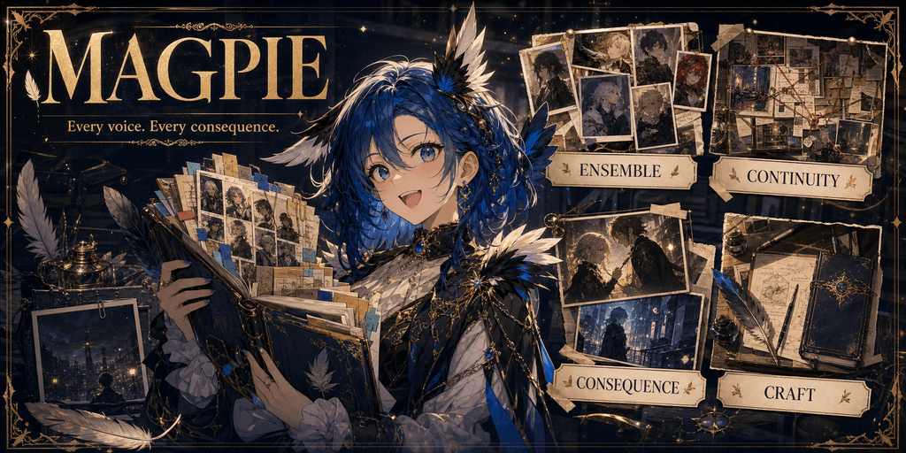

<p align="center">
  
</p>

# Magpie

**Every voice. Every consequence.**

Magpie is an ensemble-first SillyTavern preset for long-form roleplay and collaborative fiction. It is built for stories where several characters can remain important at once, continuity survives beyond the current turn, and choices leave marks instead of evaporating when the scene changes.

**Current release:** `Magpie v1 Beta-2.1.json`  
**Plotlight:** [Magpie v1 Beta-2.1](https://plotlightstudios.com/discovery/presets/@nemovonnirgend/magpie-v1-beta-21)

## What Magpie is built around

### Ensemble

Characters are treated as distinct people rather than interchangeable satellites around the user. Magpie keeps separate voices, motives, knowledge, relationships, and off-screen activity in view, allowing a cast to argue, collaborate, drift apart, and carry private agendas.

### Continuity

The preset includes dedicated continuity, dossier, location-file, important-item, databank, and ledger systems. These give the model structured places to preserve what has happened, what matters now, and what should return later.

### Consequence

Magpie expects actions to change the story. Its consequence layer supports several approaches to failure and death, including ordinary permanence, Return by Death, rolling another character, epilogues, director-style handling, and softer alternatives.

### Craft

Voice, prose, camera, length, formatting, scene headers, planning, and perspective are treated as parts of one storytelling process. The goal is not merely prettier sentences, but scenes with shape, momentum, and characters who sound like themselves.

## Major controls

Magpie includes selectable controls for:

- second-, first-, or name-based user reference
- named, rotating, or alternative character lenses
- broad, single-character, or external interiority
- past, present, or future tense
- short, long, matched, or explicit word-count responses
- maturity levels and optional adult-writing modules
- persistent narration plans, affinity, stats, inventory, cutaways, and user preferences
- several consequence and death-handling models

Most alternatives are disabled by default. Enable a module because the current story needs it, not simply because it exists.

## Quick start

1. Download `Magpie v1 Beta-2.1.json`.
2. Import it as a preset in SillyTavern or a compatible frontend.
3. Begin with the default enabled stack.
4. Choose one perspective, tense, length mode, maturity level, and consequence model at a time.
5. Add optional ledger modules only when the story benefits from that extra state.

## Repository layout

```text
Magpie/
├── Magpie v1 Beta-2.1.json   # Importable preset
├── banner.png                # Project banner
├── README.md
├── Prompts/                  # Current preset split into readable prompt files
├── Archive/                  # Older complete preset releases
└── Archived Prompts/         # Extracted prompts from archived releases
```

The files in `Prompts/` preserve prompt order, enabled state, role, injection metadata, identifier, and content. They are intended for reading, searching, comparing, and maintaining the preset. Import the JSON file when you want to use Magpie directly.

## Best suited for

Magpie is strongest when the story has a real cast, persistent relationships, recurring locations, evolving problems, and enough length for earlier choices to echo forward. It is the larger narrative machine of the family: more memory, more moving pieces, and more attention paid to who is doing what elsewhere.
