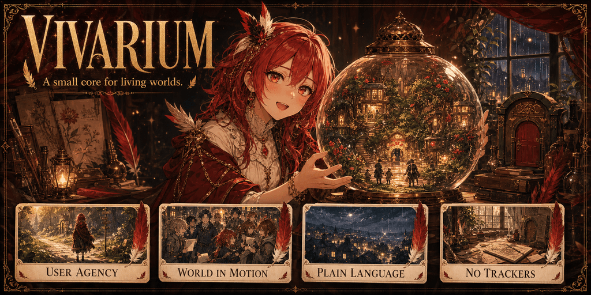

<p align="center">
  
</p>

# Vivarium

**A small core for living worlds.**

Vivarium is a compact SillyTavern preset for character-driven roleplay, slice-of-life stories, and lower-state adventures. It keeps the world active and the characters autonomous without surrounding the prose with visible trackers, elaborate dashboards, or a sprawling menu of modules.

**Current release:** `Nemo Vivarium v1.0 Beta.json`  
**Plotlight:** [Nemo Vivarium v1.0 Beta](https://plotlightstudios.com/discovery/presets/@nemovonnirgend/nemo-vivarium-v10-beta)

## The four promises

### User agency

Vivarium preserves the boundary around the user's character. The world can react, interrupt, resist, surprise, and apply consequences, but the model should not quietly decide the user's voluntary actions, dialogue, thoughts, or feelings for them.

### A world in motion

NPCs keep wants, routines, opinions, relationships, and initiative of their own. The setting does not freeze while waiting for the user to issue instructions. Small events continue, people make choices, and scenes develop from character logic.

### Plain language

The preset favors direct, natural instructions and readable prose. It is meant to work as a clean creative core rather than a tower of technical prompt jargon.

### No visible trackers

Vivarium maintains only the state it needs for continuity and scene movement. Its story data stays behind the curtain instead of turning each response into an interface.

## What is inside

Vivarium deliberately keeps the active stack small:

- **Vivarium Core** establishes authorship, agency boundaries, character autonomy, and world behavior.
- **Story Data** carries forward the essential facts of the story in plain language.
- **World Info** places lore before and after the character context.
- **Example Dialogue** and **Chat History** preserve the voice and immediate continuity of the session.
- **Turn Gate** performs the final scene-facing pass before the response.
- An optional anti-slop prompt is included but disabled by default.

That small surface is the point. Vivarium is intended to be understandable, portable, and easy to adapt.

## Quick start

1. Download `Nemo Vivarium v1.0 Beta.json`.
2. Import it as a preset in SillyTavern or a compatible frontend.
3. Leave the default stack intact for the first session.
4. Supply a strong character card, scenario, and lorebook when the story needs them.
5. Let the preset handle motion and continuity without adding visible trackers unless you deliberately want a different experience.

## Repository layout

```text
Vivarium/
├── Nemo Vivarium v1.0 Beta.json   # Importable preset
├── banner.png                      # Project banner
├── README.md
├── Prompts/                        # Current preset split into readable prompt files
├── Archive/                        # Older complete preset releases
└── Archived Prompts/               # Extracted prompts from archived releases
```

The files in `Prompts/` preserve prompt order, enabled state, role, injection metadata, identifier, and content. They are intended for reading, searching, comparing, and maintaining the preset. Import the JSON file when you want to use Vivarium directly.

## Best suited for

Vivarium is strongest for intimate stories, conversational roleplay, short-to-medium campaigns, and worlds where a few characters need to feel alive without maintaining a small bureaucracy of ledgers. It is lighter than Magpie and less configurable than Nemo Engine by design.
